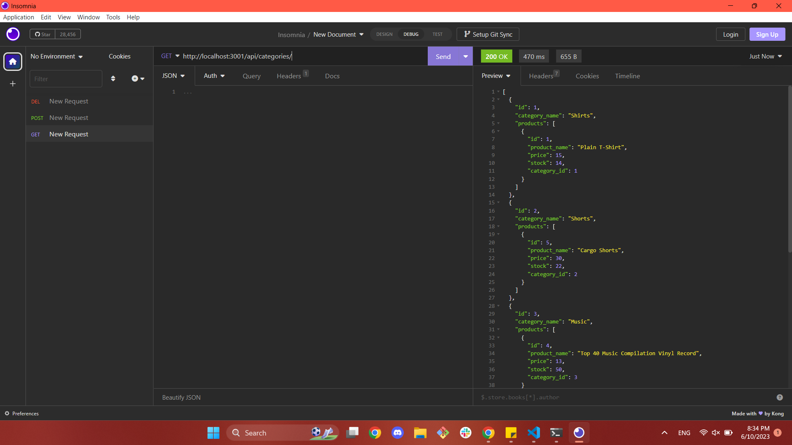

# E-commerce Back End []

  ## Description

  This project provides a functional backend code to make CRUD operations for an e-commerce company. This does not have a front-end yet, but using a program like Insomnia, a manager would be able to create, get, update, and retrieve information from the the product, tag, and category API routes. 

  There is no front-end for this appilcation yet, but if a user were to use a program like Insomnia, they should see something like the following screenshot: 
  
  This application uses Sequelize to access SQL-based commands and to perform CRUD operations. This application also uses the following packages: [dotenv](https://www.npmjs.com/package/dotenv), [express](https://expressjs.com/), [sequelize](https://sequelize.org/), and [mysql2](https://www.npmjs.com/package/mysql2). 

  Through development of this application, I have gained more comfort with performing CRUD operations using Sequelize and models.   

  ---
  ## Table of Contents 

  - [Installation](#instlalation)
  - [Usage](#usage)
  - [License](#license) 
  - [Contributing](#contributing)
  - [Tests](#tests)
  ---

  ## Installation

  To install this application, a developer must clone this repo, and on the commandline install all dependencies (command: npm i). 

  Before initalization, the user should be sure to change their database to the proper appropriate database in the MySQL command line (mysql -u {user} -p, replacing the user with the proper user, and enter the proper associated password when prompted). 
  
  Once succesfully in the MySQL command line, source the schema (source db/schema.sql).

  Additionally, a user should ensure that all their sensitive MySQL information is safely stored in a .env file. For more information on .env, please look at the [dotenv documentation](https://www.npmjs.com/package/dotenv)

  After changing to the appropriate database, a user should be sure to seed the database with the following comand: npm run seed.
  
  To initalize this application, use command npm start. After use, a user should be sure to kill the terminal to ensure the end of the server. 

  ## Usage 

  To make full use of this application, one should be sure that all requests are made to the proper API end point, with a proper json body. 

  [This video](https://www.youtube.com/watch?v=A4VsMdvv1IY) is a complete walkthrough of how to use this application. 

  ## License
  
  [License: MIT](https://opensource.org/licenses/MIT)
  
  Copyright 2023 Anna Langford
  
  Permission is hereby granted, free of charge, to any person obtaining a copy of this software and associated documentation files (the "Software"), to deal in the Software without restriction, including without limitation the rights to use, copy, modify, merge, publish, distribute, sublicense, and/or sell copies of the Software, and to permit persons to whom the Software is furnished to do so, subject to the following conditions:
  
  The above copyright notice and this permission notice shall be included in all copies or substantial portions of the Software.
  
  THE SOFTWARE IS PROVIDED "AS IS", WITHOUT WARRANTY OF ANY KIND, EXPRESS OR IMPLIED, INCLUDING BUT NOT LIMITED TO THE WARRANTIES OF MERCHANTABILITY, FITNESS FOR A PARTICULAR PURPOSE AND NONINFRINGEMENT. IN NO EVENT SHALL THE AUTHORS OR COPYRIGHT HOLDERS BE LIABLE FOR ANY CLAIM, DAMAGES OR OTHER LIABILITY, WHETHER IN AN ACTION OF CONTRACT, TORT OR OTHERWISE, ARISING FROM, OUT OF OR IN CONNECTION WITH THE SOFTWARE OR THE USE OR OTHER DEALINGS IN THE SOFTWARE.

  ## Contributing

  No other developers contributed to this application. 

  ## Tests

  This application has no tests.
